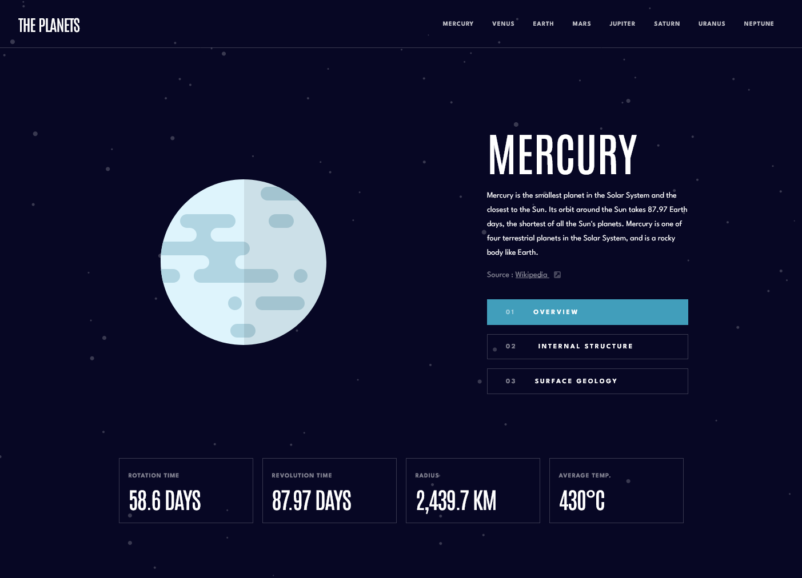

# Frontend Mentor - Planets fact site solution

This is a solution to the [Planets fact site challenge on Frontend Mentor](https://www.frontendmentor.io/challenges/planets-fact-site-gazqN8w_f). Frontend Mentor challenges help you improve your coding skills by building realistic projects. 

## Table of contents

- [Overview](#overview)
  - [The challenge](#the-challenge)
  - [Screenshot](#screenshot)
  - [Links](#links)
- [My process](#my-process)
  - [Built with](#built-with)
  - [What I learned](#what-i-learned)
- [Author](#author)

## Overview

### The challenge

Users should be able to:

- View the optimal layout for the app depending on their device's screen size
- See hover states for all interactive elements on the page
- View each planet page and toggle between "Overview", "Internal Structure", and "Surface Geology"

### Screenshot

### Links

- Solution URL: [https://github.com/tlauffs/planet-facts](https://github.com/tlauffs/planet-facts)
- Live Site URL: [https://theplanets-tlauffs.netlify.app/](https://theplanets-tlauffs.netlify.app/)

## My process

### Built with

- SCSS
- Typescript
- [Vue](https://vuejs.org/) - JS library

### What I learned

I went with a Typescript approch to complete this Project. I learned alot about Vue data, class and style-binding. This was also my first Project using SCSS.

## Author

- Website - [Tim Lauffs](https://timlauffs.com/)
- Frontend Mentor - [@tlauffs](https://www.frontendmentor.io/profile/tlauffs)
- Linkedin - [@timlauffs](https://www.linkedin.com/in/tim-lauffs-a8782421b/)

